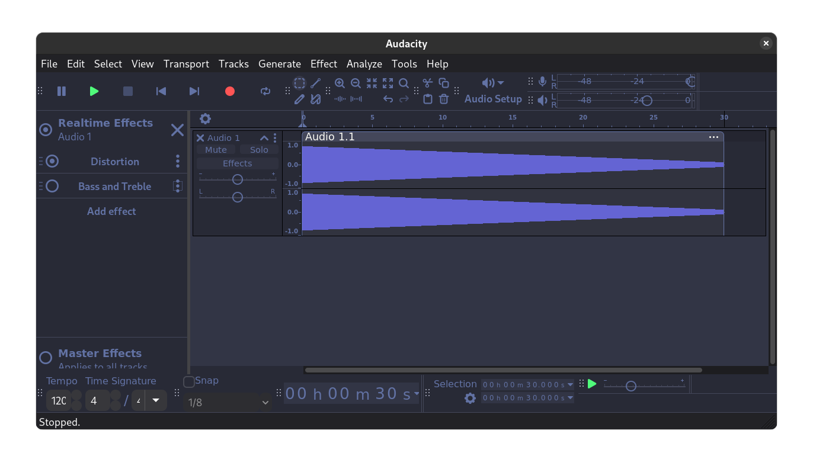

# Dracula for [Audacity](https://www.audacityteam.org/)

> A dark theme for [Audacity](https://www.audacityteam.org/).

## Install

All instructions can be found at [draculatheme.com/audacity](https://draculatheme.com/audacity).

## Team

This theme is maintained by the following person(s) and a bunch of [awesome contributors](https://github.com/dracula/audacity/graphs/contributors).

|  |
| ------------------------------------------------------------------------------------------------------- |
| [Philipp Kosarev](https://github.com/PhilippKosarev)                                                    |

## Community

- [Twitter](https://twitter.com/draculatheme) - Best for getting updates about themes and new stuff.
- [GitHub](https://github.com/dracula/dracula-theme/discussions) - Best for asking questions and discussing issues.
- [Discord](https://draculatheme.com/discord-invite) - Best for hanging out with the community.

## License

[MIT License](./LICENSE)

## Credits

Most of the [icons](https://developer.gnome.org/hig/guidelines/ui-icons.html) in this theme are taken from the GNOME project.
